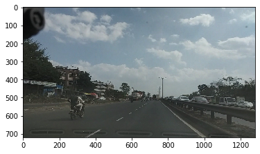
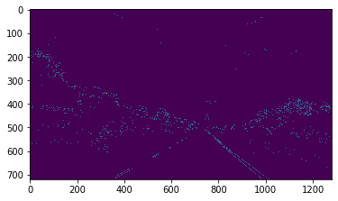
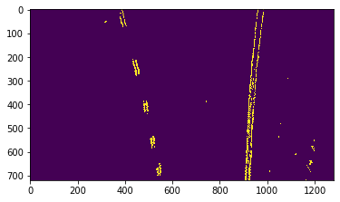
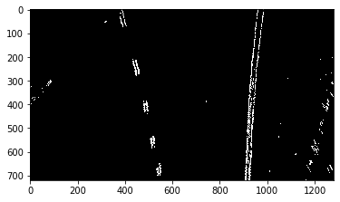
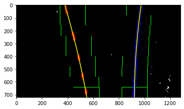
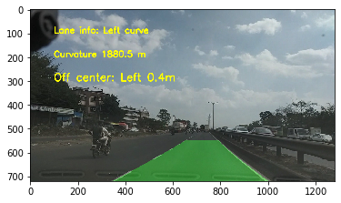

# Lane-Detection-and-Departure-Warning-System
System will detect Lane and will warn  if car is moving out of the lane.
#### 1.Input Image:

#### 2.Filtered Image

#### 3.Warped Image(Bird eye view):

#### 4.Binary Image:

#### 5.Sliding window approach to detect lanes:

#### 6.Final result:

#### System is designed for Indian highways.
